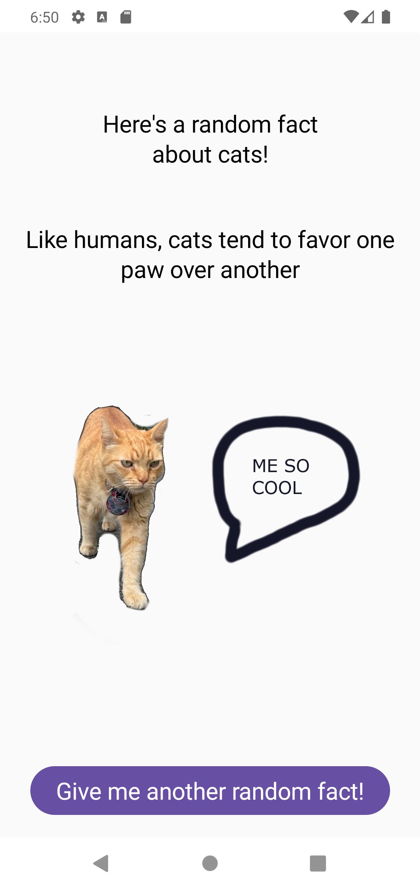
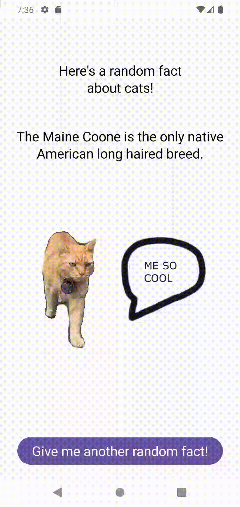

# Random Cat Fact App

Simple android app to use https://catfact.ninja/ API to show randome facts of cats!

## Purpose

Sharpening skills on Retrofit, Compose, StateFlow.

## Demo

Clicking the Button gives you another random fact!

## Learnings
Using StateFlow (state-holder Observable flow) here is great, because I want to maintain the cat fact on rotation.